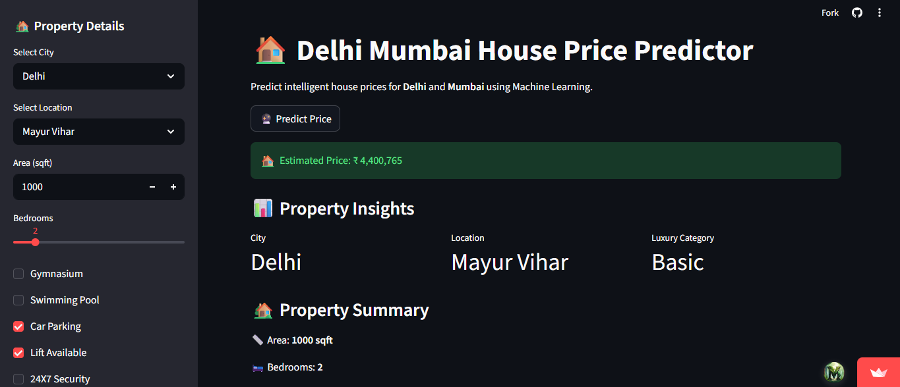

# 🏠 Delhi Mumbai House Price Predictor

An intelligent Machine Learning web application that predicts house prices for **Delhi** and **Mumbai** using **Linear Regression**, feature engineering, and real estate analytics.

---

# 🌐 Live Demo

🚀 Streamlit App:  
[STREAMLIT_LINK](https://p4delhimumbaihousepricepredictor.streamlit.app/)

🎥 YouTube Demo:  
[YOUTUBE_LINK](https://youtu.be/62DzJpkzRA0)

---

# 📌 Project Overview

This project predicts house prices based on:

- 📍 Location
- 🏙️ City
- 📏 Area
- 🛏️ Number of Bedrooms
- 🏊 Amenities
- ⭐ Luxury Features

The application also provides:
- Delhi vs Mumbai insights
- Luxury property categorization
- Real estate analytics
- Interactive user interface

---

# 🧠 Machine Learning Workflow

## 📊 Data Preprocessing
- Missing value handling
- Outlier removal
- Feature engineering
- Rare location handling
- One-hot encoding
- Feature scaling

## 🤖 ML Model
- Linear Regression

## 📈 Evaluation Metrics
- MAE
- MSE
- RMSE
- R² Score

---

# 📂 Dataset

Dataset used from Kaggle:

🔗 https://www.kaggle.com/datasets/tusharpaul2001/house-price-prediction

Cities Used:
- Delhi
- Mumbai

---

# 🚀 Features

✅ Delhi & Mumbai Prediction  
✅ Location-based Prediction  
✅ Real-time Price Prediction  
✅ Luxury Score Analysis  
✅ Interactive Streamlit Dashboard  
✅ Professional ML Pipeline  
✅ Responsive UI  

---

# 🛠️ Tech Stack

| Technology | Usage |
|---|---|
| Python | Core Programming |
| Pandas | Data Analysis |
| NumPy | Numerical Operations |
| Scikit-learn | Machine Learning |
| Streamlit | Web App |
| Joblib | Model Saving |
| Matplotlib / Seaborn | Visualization |

---

# 📊 Model Performance

| Metric | Score |
|---|---|
| R² Score | 0.81 |
| MAE | ~2 Lakhs |
| RMSE | ~3 Lakhs |

The model explains approximately **81% variance** in housing prices.

---

# 🖥️ Dashboard Preview

<p align="center">
  
</p>

---

# 📁 Project Structure

```bash
Delhi_Mumbai_House_Price_Predictor/
│
├── app.py
├── requirements.txt
├── README.md
│
├── data/
│   ├── Delhi.csv
│   └── Mumbai.csv
│
├── notebooks/
│   └── analysis.ipynb
│
├── models/
│   ├── linear_regression_model.pkl
│   ├── scaler.pkl
│   ├── model_columns.pkl
│   └── city_locations.pkl

```
---

# 📈 Future Improvements

- Random Forest / XGBoost Models
- Advanced Visual Analytics
- Price Trend Forecasting
- More Indian Cities
- Interactive Maps
- Deep Learning Integration

---

# 🙌 Author

Developed by **Manan Kohli**
